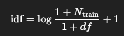

---

# What lives where

```
\dti-prediction-with-adr\Data\TFIDF_ADR_vectors
├─ idf_table.parquet
├─ drug_index.parquet
├─ adr_index.parquet
├─ global_stats.json
├─ train\
│  ├─ tfidf_wide.parquet
│  ├─ tfidf_long.parquet
│  ├─ preview_top_tfidf.parquet 
│  └─ stats.json
├─ val\
│  ├─ tfidf_wide.parquet
│  ├─ tfidf_long.parquet
│  ├─ preview_top_tfidf.parquet
│  └─ stats.json
└─ test\
   ├─ tfidf_wide.parquet
   ├─ tfidf_long.parquet
   ├─ preview_top_tfidf.parquet
   └─ stats.json
```

If you didn’t pass splits, you’ll just have the four “root” files plus `tfidf_wide.parquet` and/or `tfidf_long.parquet` directly in the root.

---

# Root files (shared by all splits)

## 1) `idf_table.parquet`

**What it is:** the dictionary that says how rare/common each ADR is **in the training drugs only**.
**Columns:**

* `meddra_id` (int64) — the ADR ID (PT/LLT).
* `df` (int32) — “document frequency”: how many **train** drugs had this ADR (presence).
* `idf` (float32) — the inverse-document-frequency weight the model used:



**Why it matters:**

* Reproducibility. If someone asks “what IDF did you use?” — it’s here.
* Transformation. The **same IDF** must be used for val/test and later inference to avoid leakage.

**Connection:** The columns in every `tfidf_*` file line up with these `meddra_id`s (same order).

---

## 2) `drug_index.parquet`

**What it is:** a stable row index for drugs.

**Columns:**

* `rxcui` (string) — RxNorm ingredient ID (drug key).
* `row_id` (int) — the integer row index used internally when the sparse matrix was built.

**Why it matters:**

* Consistent ordering. If you ever rebuild dense/sparse tensors from `tfidf_long.parquet`, you’ll need these row indices.
* Fast mapping from `rxcui` → integer row for tensor operations.

**Connection:** The row order in the **wide** files is `rxcui` ascending (not row_id), but if you ever reconstruct the matrix manually, use `row_id`.

---

## 3) `adr_index.parquet`

**What it is:** a stable column index for ADRs.

**Columns:**

* `meddra_id` (int64) — ADR ID.
* `col_id` (int) — the integer column index when building the matrix **before** filtering.

**Why it matters:**

* Bookkeeping. After we filter columns to `adrs_kept`, you still have a record of the original index assignment.
* Useful if you merge with older runs or want to track which ADRs were dropped.

**Connection:** The columns that remain after filtering are listed (and ordered) in `idf_table.parquet`.

---

## 4) `global_stats.json`

**What it is:** a quick summary of the run.

**Fields you’ll care about:**

* `n_drugs_total` — how many unique drugs (RxCUIs) in DTI.
* `n_adrs_original` — ADRs seen before filtering.
* `n_adrs_kept` — columns kept after `min_df`/`max_df`.
* `min_df_abs`, `max_df_abs` — the actual thresholds used (in counts).
* `splits` — per-split shapes and density (see split `stats.json` below).
* `note` — confirms IDF was fit on **train** only (when splits used).

**Why it matters:**

* Sanity check for sparsity and dimensions.
* You can paste this into a paper’s “Data preprocessing” section.

---

# Inside each split folder (`train/`, `val/`, `test/`)

## 5) `tfidf_wide.parquet`  ← your “full final representation”

**What it is:** one row per drug, one column per ADR. Dense table, but values are mostly zeros (compressed by Parquet).

**Columns:**

* `rxcui` — the drug ID (string)
* `meddra_<id>` (float32) — many columns like `meddra_10012345`, each is the TF-IDF weight for that ADR for this drug.

**Shape:**
`(#drugs in split) × ( #ADRs kept )`

**How to use:**

* **As input features**: fetch the row by `rxcui`, convert to a NumPy array/Tensor, and concatenate to your drug/protein embeddings (if you’re using ADRs as side-info).
* **As targets (for ADR head)**:

  * **Binary case**: treat `> 0` as “ADR present”.
  * **Weighted case**: use TF-IDF values directly (possibly normalize per row if you use cosine/KL losses).

**Connection:**

* Column order **matches** the `meddra_id`s and `idf` order in `idf_table.parquet`.
* All splits share the **same columns and order**, because the IDF was fit on train and then applied to val/test.

---

## 6) `tfidf_long.parquet`

**What it is:** the same information as `tfidf_wide.parquet`, but saved in **tidy sparse form** (only the non-zero entries).

**Columns:**

* `rxcui` (string)
* `meddra_id` (int64)
* `tfidf` (float32)

**Why it matters:**

* Lightweight. Much smaller on disk and faster to scan for analytics.
* Best format if you’ll feed this into a graph/autoencoder later.

**When to prefer long vs wide:**

* Use **wide** when your training loop expects a dense vector per drug quickly.
* Use **long** when analyzing, plotting, or reconstructing sparse tensors (e.g., SciPy CSR) without blowing up RAM.

---

## 7) `preview_top_tfidf.parquet`

**What it is:** a tiny “human check” file: for the first few drugs in the split, it lists the **top-weighted ADRs**.

**Columns:**

* `split`, `rxcui`, `meddra_id`, `meddra_name` (if available), `tfidf`

**Why it matters:**

* Quick eyeball test: “Does this look reasonable?”
* Handy in reports/screenshots to show what TF-IDF picked up for a specific drug.

---

## 8) `stats.json` (per split)

**What it is:** split-level shape and sparsity:

* `n_drugs`, `n_adrs` — dimensions of the TF-IDF matrix for this split.
* `nnz` — number of non-zero entries.
* `density` — `nnz / (n_drugs * n_adrs)` (should be very small).

**Why it matters:**

* Monitoring. If density is unexpectedly high/low, something changed.

---

# How they connect (end-to-end picture)

1. **IDF fits on training drugs only** → written to `idf_table.parquet`.

2. The set of ADR columns kept (`adrs_kept`) is the same for train/val/test → all `tfidf_*` files are aligned.

3. **Wide** and **Long** are two views of the same matrix:

   * **Wide** = easy to join with DTI by `rxcui` and feed to models.
   * **Long** = easy to aggregate, analyze, and build sparse tensors.

4. `drug_index.parquet` and `adr_index.parquet` give you stable integer indices if you want to rebuild matrices/tensors exactly.

---

# Typical “load & use” snippets

### Read wide features and join with a DTI split

```python
import pandas as pd

# Load wide TF-IDF
tfidf_wide_train = pd.read_parquet(r"...\train\tfidf_wide.parquet")  # rxcui + many meddra_* columns

# Example: join into your DTI training rows (which also have an rxcui column)
dti_train = dti_df[dti_df["rxcui"].isin(tfidf_wide_train["rxcui"])]
dti_train = dti_train.merge(tfidf_wide_train, on="rxcui", how="left").fillna(0.0)

# Now dti_train has columns for model inputs:
#  - your original features (SMILES, sequence, etc.)
#  - ADR TF-IDF columns (meddra_*)
#  - labels (DTI label)
```

### Build binary ADR targets from wide (TF-IDF > 0)

```python
tfidf_wide_train_binary = tfidf_wide_train.set_index("rxcui")
tfidf_wide_train_binary[:] = (tfidf_wide_train_binary.values > 0).astype("float32")
```

### Read long format and reconstruct a sparse matrix (SciPy CSR)

```python
import pandas as pd
from scipy import sparse as sp
import numpy as np

df_long = pd.read_parquet(r"...\train\tfidf_long.parquet")
drugs = pd.read_parquet(r"...\drug_index.parquet")
adrs  = pd.read_parquet(r"...\adr_index.parquet")

# Keep only ADRs that survived filtering (present in idf_table)
idf_table = pd.read_parquet(r"...\idf_table.parquet")
kept_set = set(idf_table["meddra_id"].astype(np.int64))

# Map keys to integer indices
rxcui_to_row = dict(zip(drugs["rxcui"], drugs["row_id"]))
meddra_to_col = {int(m): i for i, m in enumerate(idf_table["meddra_id"].astype(np.int64))}

rows = df_long["rxcui"].map(rxcui_to_row).to_numpy()
cols = df_long["meddra_id"].map(meddra_to_col).to_numpy()
data = df_long["tfidf"].to_numpy(dtype="float32")

n_rows = drugs["row_id"].max() + 1
n_cols = len(idf_table)
X = sp.coo_matrix((data, (rows, cols)), shape=(n_rows, n_cols), dtype="float32").tocsr()
```
---

# FAQ-style gotchas (in simple terms)

* **“Why are val/test columns the same as train?”**
  Because we fix the ADR vocabulary using **train** (to avoid leakage) and apply it everywhere. If an ADR never appears in train, it’s dropped (no column).

* **“My drug isn’t in ADR, what happens?”**
  That drug’s row will be all zeros. Training still works; you just won’t have prior ADR info for that drug.

* **“Wide is big — should I worry?”**
  Parquet compresses well. Use **long** for analysis and **wide** for training convenience. You can also load a subset of columns if you filtered ADRs with `min_df`/`max_df`.

* **“How do I keep things consistent if I re-run?”**
  Keep `idf_table.parquet` from the original run and reuse it to transform new data. That guarantees the same ADR columns and order.

* **“How do I report this in a thesis/paper?”**
  Say: “We constructed a drug×ADR presence matrix from RxNorm–MedDRA pairs, applied TF-IDF weighting with smoothing, fit IDF on training drugs only, filtered ADR columns by min_df/max_df thresholds, and stored both wide (dense table) and long (sparse triples) representations. Validation/test used the training IDF constants.”

---

# Quick next steps

* If you’re feeding ADR as **input**: grab `tfidf_wide.parquet` per split and concatenate per-drug vectors to your drug/protein features.
* If you’re predicting ADRs as **targets**: from `tfidf_wide.parquet`, build **binary** (TF-IDF>0) or **weighted** targets and use them for your ADR head.
* Want interpretability screenshots? Use `preview_top_tfidf.parquet` to show the top ADRs per drug in a figure or appendix.